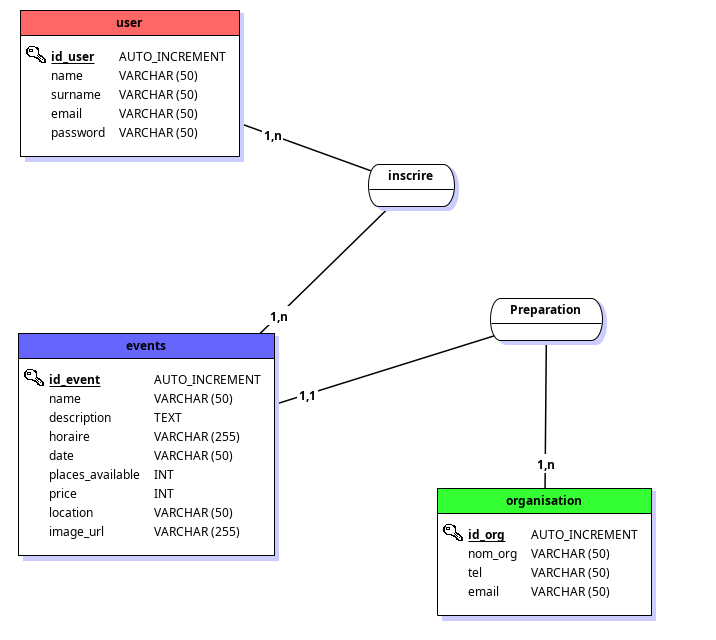
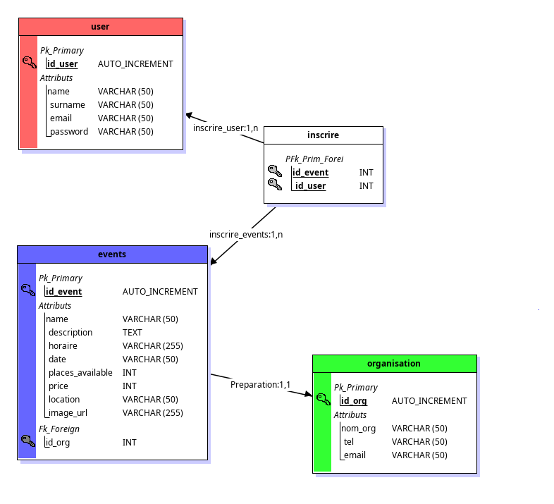

# My Project

### App Name 

PlanEvent 

### Purpose
This is an event reservation application where organizers can create events. The users will then be able to log in to the system and reserve a seat for the event. The Organization is handled by the admin.The admin can see all events and all users as well as manage them (create, delete or edit them).

###  Objectives

1. [x] - Register page for new users
2. [x] - Login Page
3. [x] - Show all oncoming events page
4. [x] - Each users can sign to an event (or multiple)
5. [x] - Show Page for a specific event with all the details (description, date, place, time, organizer, number of places available)
6. [x] - User Profile
   1. [x] - User can see all the events he signed to
   2. [x] - User can cancel his sign to an event
7. [x] - Dashboard for admin
   1. About events
      1. [x] - Show all events
      2. [x] - Create new event
      3. [x] - Edit event
      4. [x] - Delete event
   2. About users
      1. [x] - Show all users
      2. [x] - Create new user
      3. [x] - Edit user
      4. [x] - Delete user
   3. About organisers
      1. [x] - Show all organisers
      2. [x] - Create new organiser
      3. [X] - Edit organiser
      4. [x] - Delete organiser
   <!-- 4. About Locations
      5. [ ] - Show all locations
      6. [ ] - Create new location -->

#### Changes to be made
1. [ ] - Order events to not display passed events
2. [ ] - Pagination for admin dashboard when viewing users, organisers, locations and events
3. [x] - Button "book now" only appears when user is logged in
4. [ ] - Add a Hero Section on the main page to welcome new visitors appropriately
5. [ ] - Add a Search input in the admin section for:
   1. [ ] - Searching for a specific user through name or email
   2. [ ] - Searching for a specific event through name or description
6. [ ] - Add a filter for users (to see who's an admin and who's a user)
7. [ ] - Add a filter for events (to see which events are coming soon, which are today, which are past and by category)
8. [X] - Change the "Edit" and "Delete" Buttons For Users, Organizers and Events
9. [ ] - For the edit Section in users, Change the Input role to a Select with the two options, admin or user.
10. [ ] - Make the UI for admin while viewing an event more user friendly.
11. [ ] - Make the UI for participation and information about an event more user friendly.
12. [ ] - Make the logo clickable to go to the main page.
13. [ ] - Add a "No account? Sign up" link on the login page.
14. [ ] - Add a "Already have an account? Log in" link on the register page.
15. [ ] - In Admin Panel, in the "All Users" page, show their linked events in a list
16. [ ] - In all Events show page, change the disposition of the card so that all look the same, with the same proportions but witout the same amount of infos

##  Data Dictionnary

### user table
| Column Name  | Data Type | Constraints| Description |
|:-------------|:---------:|:----------:|:------------|
| id_user      | INT       | PRIMARY KEY, AUTO_INCREMENT       |Unique identifier for each user
| name         | VARCHAR(50)| NOT NULL | Username chosen by the user |
| email        | VARCHAR(50)| NOT NULL , UNIQUE       | Hashed password for authentication |
| password     | VARCHAR(255)| NOT NULL        | User's email address |
| role         | VARCHAR(15)| NOT NULL       | User's attributed role |

  ### events table
| Column Name  | Data Type | Constraints| Description |
|:-------------|:---------:|:----------:|:------------|
| id_event     | INT       |PRIMARY KEY, AUTO_INCREMENT |Unique identifier for each events|
|name|VARCHAR(255)|NOT NULL| Name of the event|
|description|VARCHAR(255)|NOT NULL|Description for the event|
|time|VARCHAR(255)|NOT NULL| Time of the event|
|date|VARCHAR(255)|NOT NULL| Date of the event|
|places_available|INT|NOT NULL| Number of places available for the event|
|price|INT|NOT NULL| Price of the event|
|location|Varchar(255)|NOT NULL| Location of the event|
|image_url|Varchar(255)|NOT NULL| URL of the image of the event|
|id_org|INT|FOREIGN KEY, NOT NULL| ID of the organiser of the event|

  ### organisation table
| Column Name  | Data Type | Constraints| Description |
|:-------------|:---------:|:----------:|:------------|
|id_org        |INT        | PRIMARY KEY| Unique identifier for each organizers|
|nom_org       |VARCHAR(255)|NOT NULL | Name of the organisation|
|tel           |VARCHAR(255)|NOT NULL | Phone number of the organisation|
|email         |VARCHAR(255)|NOT NULL | Email of the organisation|

  ### inscrire table
| Column Name  | Data Type | Constraints| Description |
|:-------------|:---------:|:----------:|:------------|
| id_event|INT|PRIMARY KEY| Unique identifier for each event|
|id_user |INT|PRIMARY KEY| Unique identifier for each user|

## MLD and MCD

## Wireframes
[Link to Figma](https://www.figma.com/design/nbRwW6hOlMs9gBS2cTciAy/Untitled?node-id=2-2&t=cpN36eDC0DBaEySd-0)
 
[Link to PDF with all the images](Maquettage.pdf)
